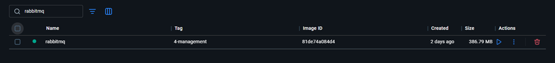
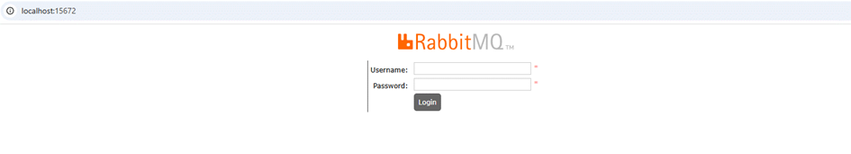

# Ders 2 - RabbitMQ Kurulumu

## İçindekiler

* [Docker ile Kurulum](#docker-ile-kurulum)
* [RabbitMQ Management Panel](#rabbitmq-management-panel)
* [Cloud Alternatifi](#cloud-alternatifi)

---

# Docker ile Kurulum

* Dockerize ederek ya da Cloud ortamında kurabiliriz.

```bash
docker run -it --rm --name rabbitmq -p 5672:5672 -p 15672:15672 rabbitmq:4-management
```

* Docker Desktop kurup çalıştırmayı unutmayın 😊 yoksa hata alırsınız.
* Yukarıdaki kodu terminalde çalıştırdığınızda Docker Desktop üzerinden aşağıdaki container’ı görebilirsiniz.
* Ben Eğitim boyunca Windows ortamında Docker Desktop kullanarak localde çalıştım.

---

# Docker Container Görünümü

Docker Desktop üzerinden container şu şekilde görünür.



---

# RabbitMQ Management Panel

Hangi portta ayağa kaldırdıysak tarayıcı üzerinden o porta gittiğimizde bizi aşağıdaki sayfa karşılayacaktır.

Örneğin:

```text
http://localhost:15672
```



---

# Giriş Bilgileri

Docker ile local çalıştırdığımızda default olarak gelen bilgiler:

```text
username: guest
password: guest
```

---

# Cloud Alternatifi

İsterseniz Cloud ortamında da ücretsiz olarak kullanabilirsiniz. (Eğitim boyunca Cloud kullanılıyor.)

CloudAMQP:
https://www.cloudamqp.com/
