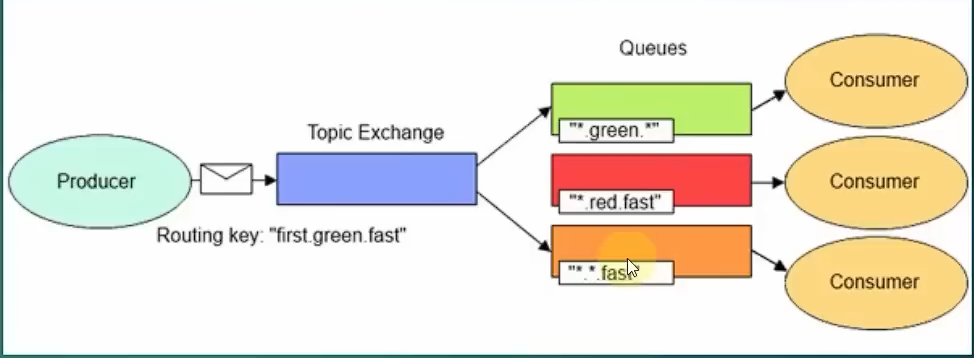

# Ders 3 - Exchange Yapısı

## İçindekiler

* [Exchange](#exchange)
* [Route](#route)
* [Binding](#binding)
* [Exchange Types](#exchange-types)

  * [Direct Exchange](#direct-exchange)
  * [Fanout Exchange](#fanout-exchange)
  * [Topic Exchange](#topic-exchange)
  * [Header Exchange](#header-exchange)

---

# Exchange

* Exchange: Publisher tarafından gönderilen mesajın hangi route’a yönlendirileceğini karar veren yapıdır. Elimizde birden fazla kuyruk olabilir hangi kuyruğa hangi mesajın gideceğini belirler.

---

# Route

* Route da Exchange’den kuyruklara gidecek mesajların nasıl gönderileceğini tanımlayan mekanizmadır.
* Her Exchange bir Route’a sahiptir diyemeyiz.
* Bir Exchange’de birden fazla kuyruk olabilir. İstersek ilişkilendirebiliriz.

---

# Binding

* Binding: Exchange ve Queue arasındaki ilişkiyi ifade eden yapıdır.

---

# Exchange Types

## Direct Exchange

* En sade Exchange türüdür.
* Exchange belirtilmediyse Default atanana tiptir.
* Bir mesajın direk belirli bir kuyruğa gönderilmesini sağlayan yapıdır.
* Routing key ile Queue ismini aynı kullanırız.
* Hata mesajlarının işlendiği senaryolarda sıkça kullanılır.

Dosya yükleme hatası aldık → onunla ilgilenecek olan consumer’ın bunu anlaması için direk ilgili kuyruğa bilgi gönderip o servisin işini yapması beklenebilir.

Ya da sipariş statülerine (“Onaylandı”, “İptal Edildi”, “İade Edildi”) göre servisleri birbirinden ayırıp direk ilgili kuyruğun işlem yapmasını sağlayabiliriz.

---

## Fanout Exchange

* En ilkel Exchange türüdür diyebiliriz.
* Bu Exchange bind edilmiş tüm Queue’lara mesajı gönderir.
* Bir bilgiyi ya da veriyi tüm servislere göndermek iletmek istiyorsak kullanabileceğimiz tiptir.

Ana haber kanallarını dinlemek buna bir örnek olabilir.
Ana haber kanalını dinleyen herkese o bilgi aktarılır.

Yani o haber kanalına bind edilen tüm izleyicilere o bilgi aktarılır.
Herhangi bir ayrım yapılmaz.

---

## Topic Exchange

* Buradaki mantık aslında ortak küme gibi bir şeydir.
* Routing key vardır.
* O key’e uygun Queue’lara mesaj iletilir.
* Gönderilen key ile Queue arasında ortak bir bağlantı olması gerekir.
* Eğer varsa o Queue’lara mesaj iletilir, yoksa iletilmez.

Bu kısım için eğitimdeki görseli de ekliyorum.

---

## Header Exchange

* Topic ile benzerlik gösterir.
* Tek farkı routing key yerine header’dan veriyi göndermektir.
* Key – Value mantığıyla hareket eder.
