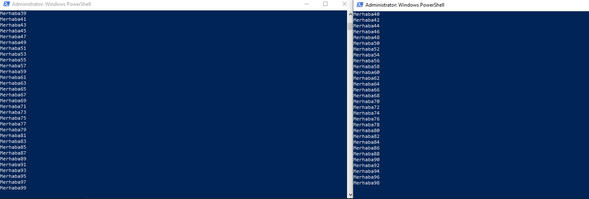
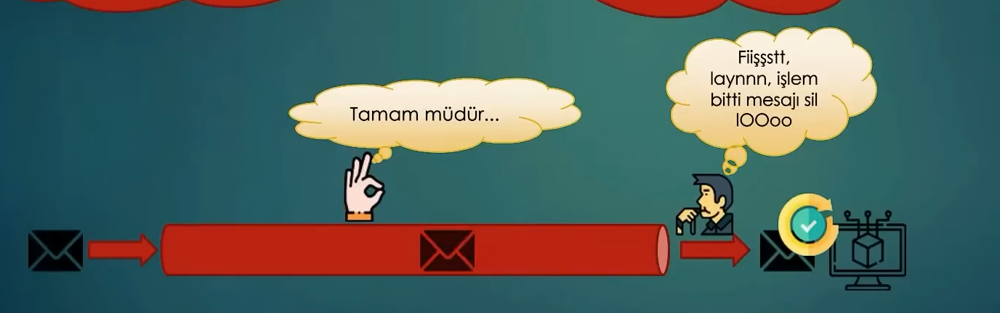

# Ders 5 - RabbitMQ Konfigürasyonları

## İçindekiler

* [Genel Mantık](#genel-mantık)
* [Round Robin Dispatching](#round-robin-dispatching)
* [Message Acknowledgement (Mesaj Onaylama)](#message-acknowledgement-mesaj-onaylama)
* [Message Durability](#message-durability)
* [Fair Dispatch](#fair-dispatch)

---

# Genel Mantık

* RabbitMQ’yu genelde projelerde dümdüz ayağa kaldırmak bizim işimize yaramıyor. Gerekli ayarlarla birlikte configure edebilmeliyiz.
* Örneğin bir kuyruktaki mesajlar başka consumer’lar tarafından da tüketilmelidir. Bunun için o mesajın silinmemesi gerekir.
* Dağıtık bir mimaride asenkron olarak işlemlerin ilerlemesini istiyorsak RabbitMQ’nun bize sunmuş olduğu yapıyı kullanıyoruz.
* Yani amacımız kuyruklara mesajları göndermek, consumer’ların da işlem yapmaları gerektiği zaman bunları tüketmesi üzerine kuruludur.
* Senaryolara göre durumlar configure edilir.

---

# Round Robin Dispatching

* RabbitMQ’da default olarak tüm consumer’lara mesajlar sırasıyla gönderilir.

Örnek olarak Publisher’ımızı ayağa kaldırdığımızda birden fazla consumer olduğunda kodumuza göre şöyle bir çıktı alacağız:



Kodumuzun son hali de şu şekildeydi, hatırlatmak için:

```csharp
for (int i = 0; i < 100; i++)
{
    await Task.Delay(200);
    byte[] message = Encoding.UTF8.GetBytes("Merhaba" + i);

    await channel.BasicPublishAsync(exchange: "", routingKey: "example-queue", body: message);
}
```

---

# Message Acknowledgement (Mesaj Onaylama)

* RabbitMQ’da consumer’a gönderilen mesaj ister başarılı ister başarısız olsun Queue’dan silinmek üzere işaretlenir.
* Mesela bir sipariş verdik, Queue’ya mesaj gönderdik. Eğer o siparişin başarılı bir şekilde consumer tarafından tüketildiğinden emin olmadan o message’ı silersek olası veri kayıplarına sebebiyet vermiş oluruz.
* Message consumer’da yaşanan herhangi bir problemden dolayı işlenemediği takdirde görev tamamlanmış sayılacaktır.
* Consumer: Bana gelen mesajı aldım işledim. Şimdi Queue’ya demem lazım ki bununla işim bitti.

Hocamızın slaytından örnek:



* Bununla birlikte garantili bir yapıya geçmiş olacağız.
* Unutulmaması gereken nokta işlem bittikten sonra RabbitMQ’ya işlendiğine dair kesin bilgi vermek zorundayız.
* Eğer bunu yapmazsak message tekrar Queue’ya gidecek ve başka bir consumer tarafından tüketilecektir. Bu da tutarsız bir veri oluşmasına sebep olabilir.
* Message Ack consumer tarafında yapılandırılır.

### Basic Ack

```csharp
await channel.BasicConsumeAsync(queue: "example-queue", autoAck: false, consumer: consumer);

consumer.ReceivedAsync += async (sender, e) =>
{
    // Kuyruğa gelen mesajın işlendiği yerdir.

    // e.Body : Kuyruktaki mesajın verisini bütünsel olarak getirecektir.

    // e.Body.Span veya e.Body.ToArray() : Kuyruktaki mesajın verisini byte[] olarak getirecektir.

    Console.WriteLine(Encoding.UTF8.GetString(e.Body.Span));

    await channel.BasicAckAsync(deliveryTag: e.DeliveryTag, multiple: false); 
    // Kuyruktaki mesajın işlendiği bilgisini RabbitMQ'ya iletir.
    // Böylece RabbitMQ mesajı kuyruktan siler.
};
```

* BasicNack
* BasicCancel
* BasicReject

---

# Message Durability

RabbitMQ çökerse ne olacak?

* Normal şartlarda kapanırsa tüm mesaj ve Queue’lar silinecektir.
* Bunun olmaması için ekstra konfigürasyon ayarları yapmamız gerekir.
* Aksi halde ciddi veri kayıpları yaşanabilir.
* RabbitMQ’ya bu message ve Queue’yu kalıcı hale getirmesini söylememiz gerekir.

Örnek kod:

```csharp
var properties = new BasicProperties
{
    DeliveryMode = DeliveryModes.Persistent
};

for (int i = 0; i < 100; i++)
{
    await Task.Delay(200);
    byte[] message = Encoding.UTF8.GetBytes("Merhaba" + i);

    await channel.BasicPublishAsync(
        exchange: "",
        routingKey: "example-queue",
        body: message,
        mandatory: false,
        basicProperties: properties);
}
```

**Consumer tarafında da durable parametresini ayarlamayı unutmayalım.**

```csharp
await channel.QueueDeclareAsync(
    queue: "example-queue",
    exclusive: false,
    durable: true);
```

Consumer’daki Queue yapılanması Publisher’dakiyle birebir aynı yapılandırmayla olmalıdır.

Unutma ki bu şekilde kalıcı olarak işaretlesek de iletinin kaybolmayacağı anlamına gelmez.

---

# Fair Dispatch

* Consumer’lara mesajlar eşit şekilde iletilir.
* Bir consumer’ın diğerlerinden daha fazla iş alıp diğerlerinin boşta kalması engellenir.

Mesaj işleme konfigürasyonu:

```csharp
await channel.BasicQosAsync(0, 1, false);
// Consumer'ın aynı anda sadece 1 mesajı işlemesini sağlar.
// Böylece mesajların sırayla işlenmesi sağlanır.
```
